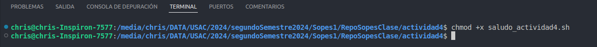
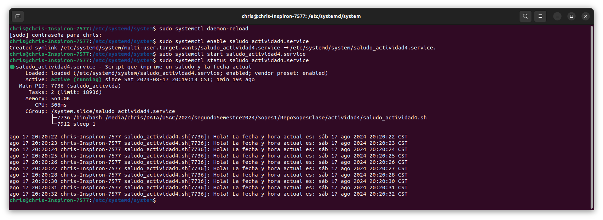
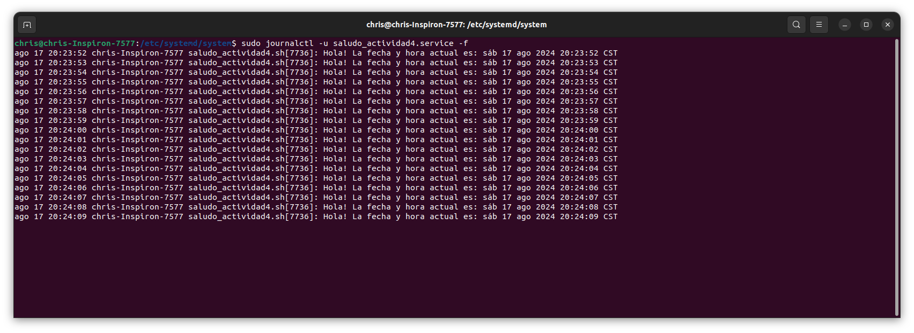

# Servicio systemd: Saludo y Fecha
Este servicio ejecuta un script de Bash que imprime un saludo y la fecha actual en un bucle infinito.
## Instalación
1. Crear el script `saludo_actividad4.sh` a la ubicación deseada y hazlo ejecutable. En mi caso esta es la ruta del script:
   ```bash
   chmod +x /media/chris/DATA/USAC/2024/segundoSemestre2024/Sopes1/RepoSopesClase/actividad4/saludo_actividad4.sh

2. Copiar el archivo de servicio en /etc/systemd/system/saludo_actividad4.service con el siguiente contenido:

    [Unit]
    Description=Script que imprime un saludo y la fecha actual
    After=network.target

    [Service]
    ExecStart=/media/chris/DATA/USAC/2024/segundoSemestre2024/Sopes1/RepoSopesClase/actividad4/saludo_actividad4.sh
    Restart=always

    [Install]
    WantedBy=multi-user.target
ExecStart guarda la direccion de nuestro script saludo_actividad4.sh

3. Recargar systemd, habilita y arranca el servicio con los comandos:
    ```bash
    sudo systemctl daemon-reload
    sudo systemctl enable saludo_actividad4.service
    sudo systemctl start saludo_actividad4.service
4. Verificar si esta activo con:
    ```bash
    sudo systemctl status saludo_actividad4.service


5. Si se desea ver los logs del servicio se puede usar el siguiente comando:
    ```bash
    sudo journalctl -u saludo_actividad4.service -f


6. Si deseamos detener el servicio se puede usar el comando:
    ```bash
    sudo systemctl stop saludo_actividad4.service
7. Si en algún momento deseamos detener este comportamiento, se puede deshabilitar el servicio con:
    ```bash
        sudo systemctl disable saludo_actividad4.service
