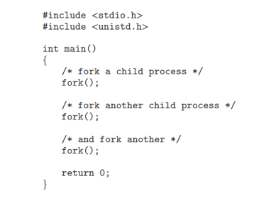
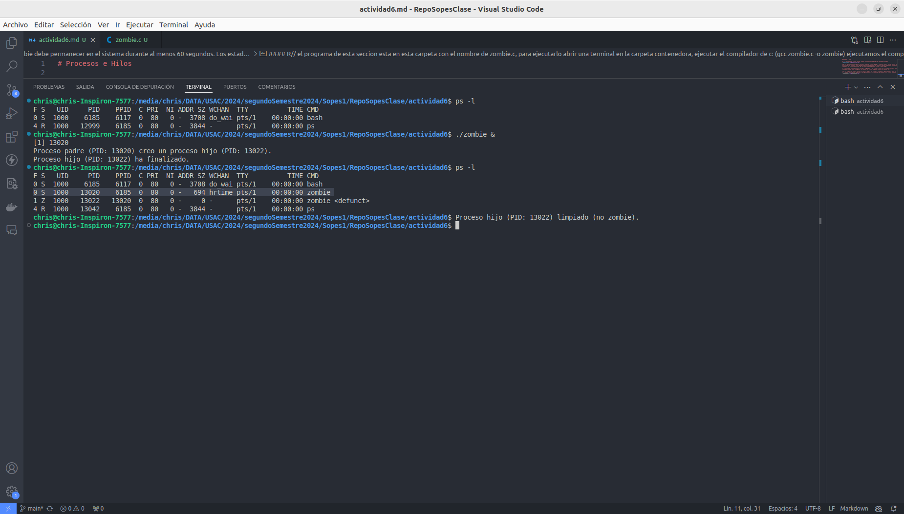
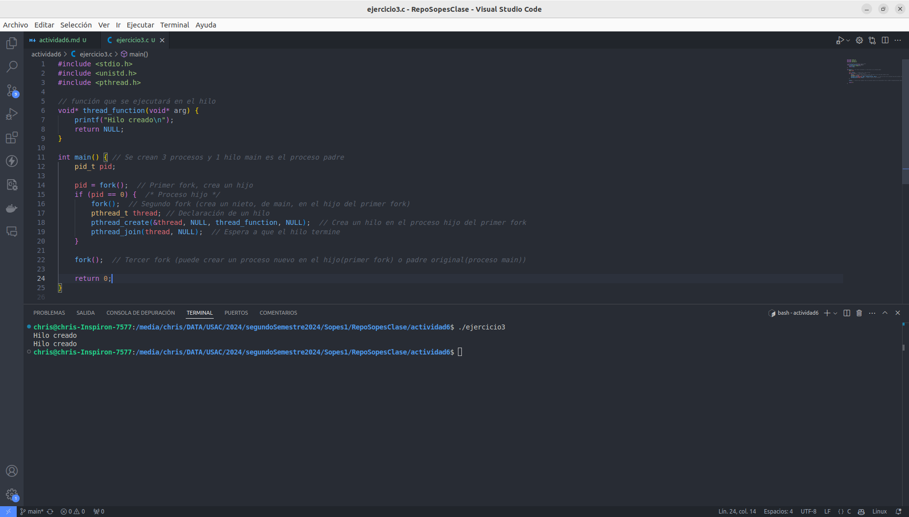

# Procesos e Hilos

## 1. ¿Incluyendo el proceso inicial, cuantos procesos son creados por el siguiente programa?

#### R// La funcion inicial main() nos genera el primer proceso, debido a la syscall fork(), el cual duplica los procesos actuales al ejecutarse se genera otro proceso, el cual es copia del original, el siguiente fork() debido a que existen 2 procesos, al ejecutare duplica los procesos existententes,  por lo tanto tenemos 4 procesos, el tercer fork al ejecutarse duplica nuevamente los procesos existentes, por lo tanto tenemos 8 procesos activos en este codigo.

## 2. Utilizando un sistema Linux, escriba un programa en C que cree un proceso hijo (fork) que finalmente se convierta en un proceso zombie. Este proceso zombie debe permanecer en el sistema durante al menos 60 segundos. Los estados del proceso se pueden obtener del comando: ps -l

#### R// el programa de esta seccion esta en esta carpeta con el nombre de zombie.c, para ejecutarlo abrir una terminal en la carpeta contenedora, ejecutar el compilador de c: (gcc zombie.c -o zombie) ejecutamos el compilado de la siguiente manera: (./zombie &), ya podemos ver el proceso zombie en la terminal (ps -l). 

## 3. Usando el siguiente código como referencia, completar el programa para que sea ejecutable y responder las siguientes preguntas: ¿Cuántos procesos únicos son creados? ¿Cuántos hilos únicos son creados?

#### R// 
Procesos:
Primer fork(): 1 nuevo proceso (padre + hijo).
Segundo fork() (dentro del proceso hijo): 1 nuevo proceso (nieto de main).
Tercer fork() se ejecuta en el padre, el hijo y el nieto, por lo que:
El padre crea un nuevo proceso.
El hijo crea otro proceso.
El nieto también crea otro proceso.
En total, los procesos son:

Proceso original (padre).
Hijo del primer fork().
Nieto del segundo fork().
Tres nuevos procesos del tercer fork(), uno por cada proceso existente en ese momento.

Total de procesos: 6 procesos únicos.

Hilos:
Solo el hijo original (creado en el primer fork) ejecuta pthread_create(), creando un solo hilo. (se imprime 2 veces por que Cuando un proceso que tiene un hilo (en este caso, el hijo) ejecuta un fork(), el nuevo proceso "clona" el estado actual del proceso padre (incluyendo los hilos). Esto significa que el hilo creado en el proceso hijo también se hereda por el nuevo proceso creado a partir del tercer fork()).

Total de hilos: 1 hilo único.

