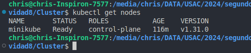
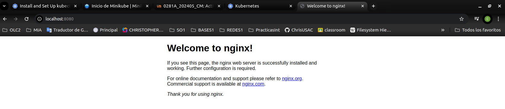

# Primeros pasos con K8s
## Instalacion de kubectl
```bash
sudo apt-get install -y kubectl
```
## Verificacion de instalacion correcta
```bash
kubectl version --client
```
## Instalacion de minikube en Linux
```bash
curl -LO https://storage.googleapis.com/minikube/releases/latest/minikube-linux-amd64
sudo install minikube-linux-amd64 /usr/local/bin/minikube && rm minikube-linux-amd64
```

## inicio del kluster
```bash
minikub start
```

## Ubicarse en la carpeta del archivo deployment.yaml y ejecutar:
```bash
kubectl apply -f deployment.yaml
```

## para ver los nodos
```bash
kubectl get nodes
```


## exponer el puerto en el servicio.
```bash
kubectl port-forward deployments/myapp 8080:80 -n default
```

## Servicio en el localhost 8080
 

## ¿En un ambiente local de Kubernetes existen los nodos masters y workers, como es que esto funciona?

- Se crea un solo nodo el cual actua como master y worker, el master gestiona API Server, Scheduler, Controller-Manager, etcd, el worker ejecuta los contenedores.